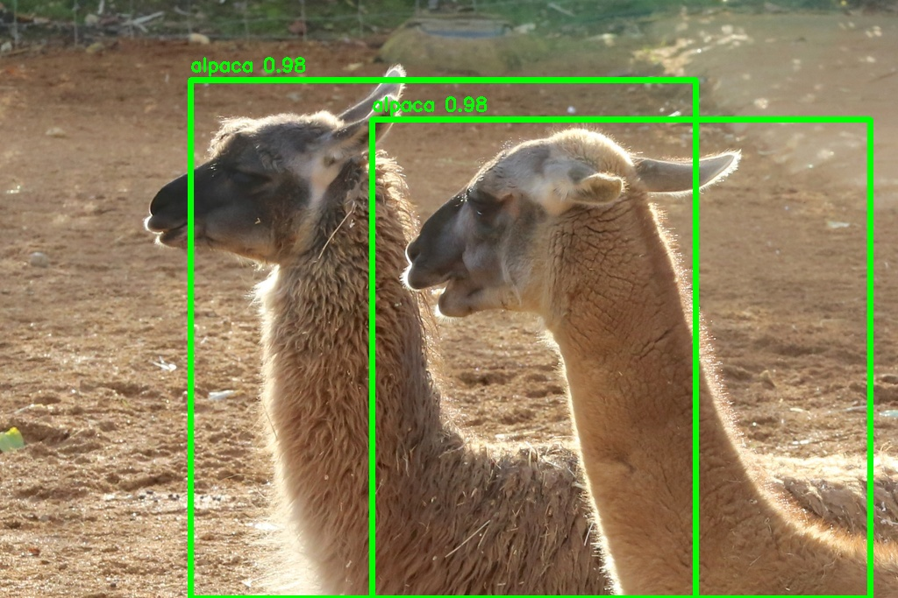
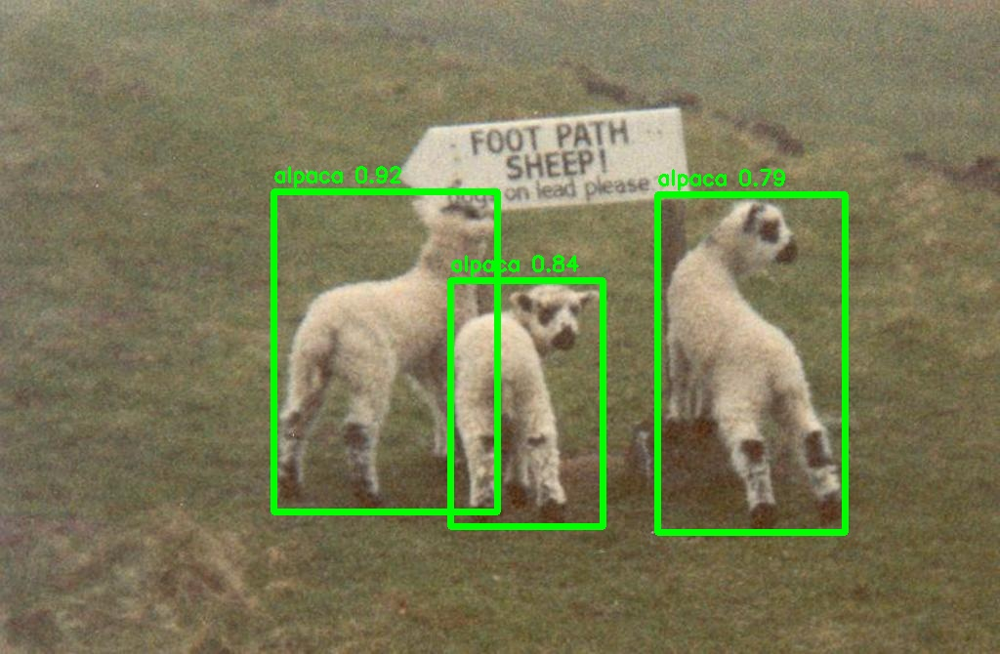
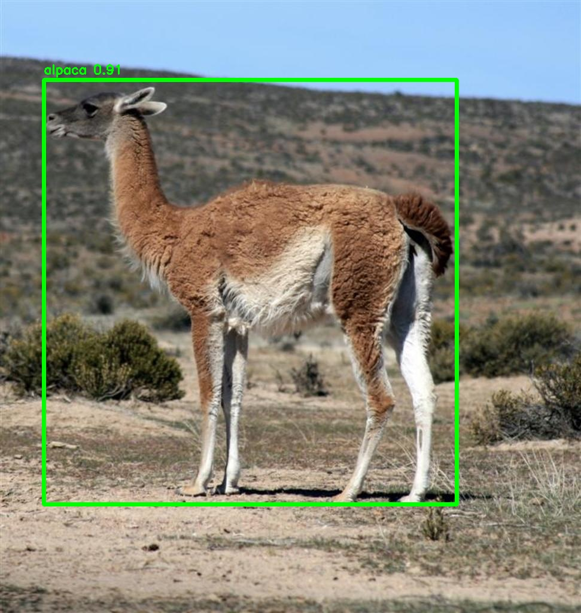
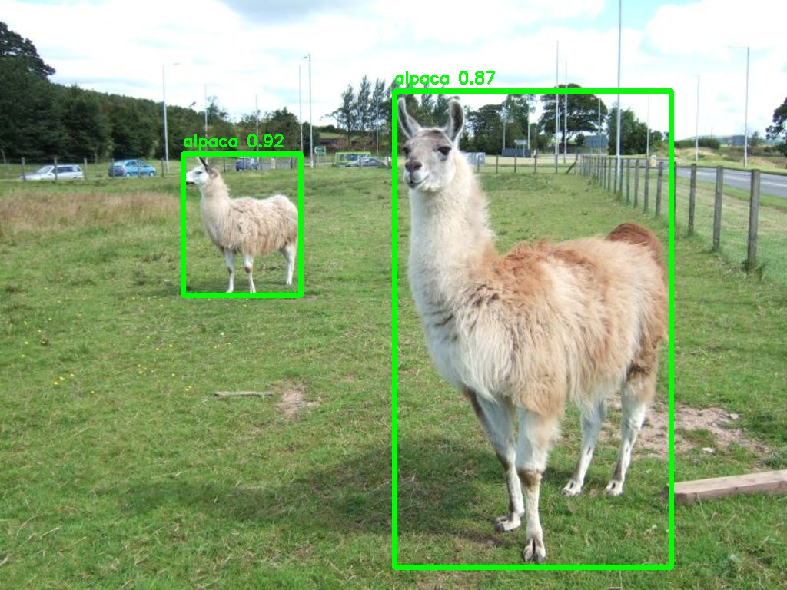
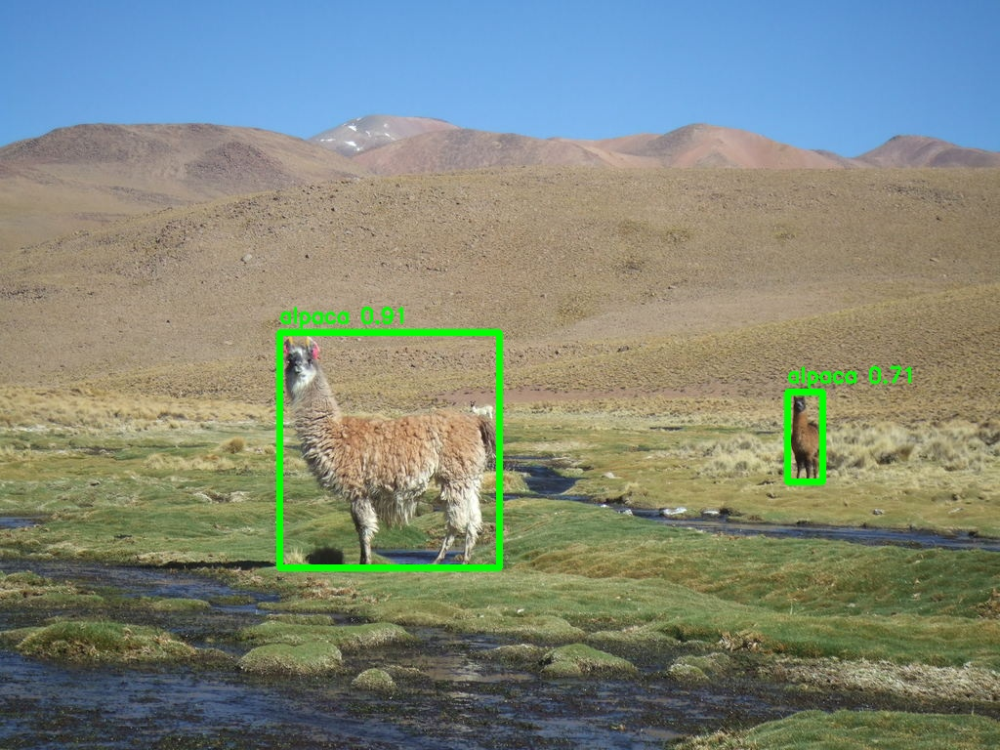
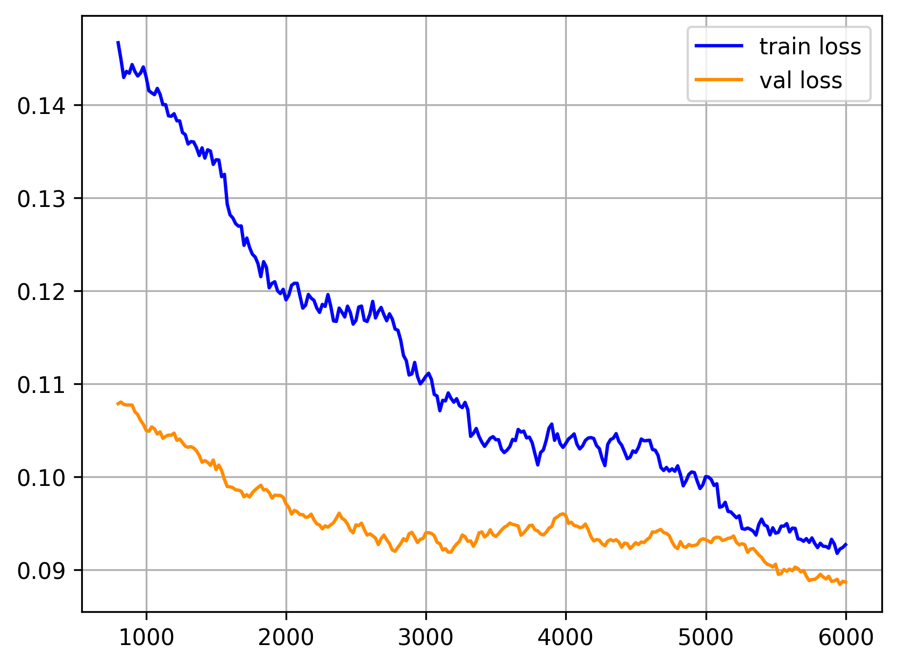

<div align="center">

# 🦙 Alpaca Object Detection

**Fine-tuned RetinaNet R-101 · Detectron2 · Streamlit**

[](https://python.org)
[](https://pytorch.org)
[](https://github.com/facebookresearch/detectron2)
[](https://streamlit.io)
[](LICENSE)

<br/>

> A complete end-to-end object detection pipeline —  
> from dataset preparation to a deployed interactive web application.

</div>

---

## 🎬 Demo


---

## 🔍 Example Predictions

<p align="center">
  
  
</p>

<p align="center">
  
  
</p>

<p align="center">
  
</p>

## 💡 Key Features

- 🔁 **End-to-end ML pipeline** — from raw images to a deployed web app
- 🪝 **Custom Detectron2 training hook** — real-time validation loss monitoring during training
- 📐 **COCO-style evaluation** — standard AP/AR metrics on a held-out test set
- 🌐 **Interactive Streamlit app** — upload any image, get instant predictions with Plotly visualizations
- 🗂️ **Batch inference pipeline** — run predictions on entire folders of images
- 📦 **Clean modular structure** — separated training, app, dataset tools, and results

---

## 🏆 Results

<div align="center">

| Metric | Value |
|:---|:---:|
| **AP @ IoU 0.50** | **92.0 %** |
| **AP @ IoU 0.50:0.95** | **74.6 %** |
| **AP @ IoU 0.75** | **79.2 %** |
| **AR @ maxDets = 100** | **82.6 %** |

*Evaluated on a held-out test set using the standard COCO evaluation protocol.*

</div>

---

## 📊 Training Loss

<div align="center">
  
  <br/>
  <sub>Both losses converge smoothly — no signs of overfitting.</sub>
</div>

---

## 🖥️ Web Application

The Streamlit app lets you upload any image and instantly detects alpacas with bounding boxes and confidence scores.

```bash
streamlit run app/main.py
```

**Features:**
- 🎛️ Adjustable confidence threshold slider
- 📊 Live metrics: count · average confidence · top confidence
- 🔍 Interactive Plotly bounding box visualization
- 📋 Raw detection data expander

---

## 🧠 Model

#### Architecture

| Component | Detail |
|:---|:---|
| Architecture | RetinaNet |
| Backbone | ResNet-101 + FPN |
| Pretrained On | COCO |
| Fine-tuned On | Custom alpaca dataset |
| Training Iterations | 6,000 |
| Classes | 1 (Alpaca) |
| Framework | Detectron2 (PyTorch) |

#### Model Size

| Parameter | Value |
|:---|:---|
| Total Parameters | ~57M |
| Backbone | ResNet-101 (~44M params) |
| Detector Head | RetinaNet FPN (~13M params) |
| Input Resolution | Variable (FPN handles multi-scale) |
| Model File Size | ~455 MB |

---

## ⚙️ Installation

```bash
# 1. Clone the repo
git clone https://github.com/MhmdGamalAskar/alpaca-object-detection.git
cd alpaca-object-detection

# 2. Install dependencies
pip install -r requirements.txt
```

---

## 🚀 Usage

### Train
```bash
python -m training.train \
  --data-dir   ./data \
  --class-list ./class.names \
  --output-dir ./results \
  --device     cuda \
  --learning-rate 0.00025 \
  --iterations 6000
```

### Evaluate
```bash
python -m training.evaluation
```

### Batch Inference
```bash
python predict.py
# → saves annotated images to data/test/predictions/
```

### Web App
```bash
streamlit run app/main.py
```

---

## 📁 Dataset Format

Annotations in **YOLO format**: `class xc yc w h` (normalized)

```
data/
├── train/
│   ├── imgs/   ← .jpg images
│   └── anns/   ← .txt annotations
├── val/
│   ├── imgs/
│   └── anns/
└── test/
    ├── imgs/
    └── anns/
```

---

## 📂 Project Structure

```
alpaca-object-detection/
├── app/                        # Streamlit web app
│   ├── main.py
│   └── bg3.png
│
│── assets/
│     └── detection.jpg
│
├── training/                   # Training pipeline
│   ├── train.py
│   ├── util.py
│   ├── loss.py                 # Custom ValidationLoss hook
│   ├── evaluation.py
│   └── plot_loss.py
├── dataset_tools/              # Dataset preparation
│   ├── downloader.py
│   ├── make_yolo_dataset.py
│   └── make_list.py
├── demo/
│   └── demo.mp4                # App demo video
├── results/
│   └── loss_plot.png
├── predict.py
├── class.names
├── requirements.txt
└── Train_Detectron2.ipynb
```

---

## 🧪 Tech Stack

`Python` · `PyTorch` · `Detectron2` · `OpenCV` · `Streamlit` · `Plotly` · `NumPy`

---

## 📄 License

MIT License © [MhmdGamalAskar](https://github.com/MhmdGamalAskar)
